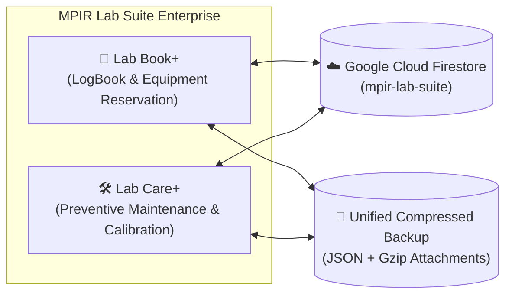
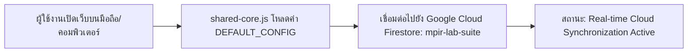

# คู่มือการใช้งานระบบ MPIR Lab Suite
**ระบบสารสนเทศห้องปฏิบัติการวิจัยและทดลองแบบครบวงจร**  
*ครอบคลุมระบบ Lab Book+ (Lab Equipment LogBook) และ Lab Care+ (MPIR Lab Care+)*  
**เวอร์ชัน 2.2 Enterprise Production Release** | ฝ่ายวิจัยและนวัตกรรม กลุ่มมิตรผล (MPIR)  
**URL เผยแพร่หลัก**: `https://labbookplus.netlify.app/`

---

## สารบัญ

1. [บทนำและภาพรวมระบบ](#1-บทนำและภาพรวมระบบ)
2. [การเริ่มต้นใช้งานและการเข้าสู่ระบบ (Authentication & SSO)](#2-การเริ่มต้นใช้งานและการเข้าสู่ระบบ-authentication--sso)
   - [2.1 บัญชีผู้ใช้งานเริ่มต้นและระดับสิทธิ์](#21-บัญชีผู้ใช้งานเริ่มต้นและระดับสิทธิ์)
   - [2.2 การเข้าสู่ระบบแบบครั้งเดียว (Single-Sign-On)](#22-การเข้าสู่ระบบแบบครั้งเดียว-single-sign-on)
   - [2.3 การสลับระบบแบบไร้รอยต่อโดยไม่ต้องล็อกอินซ้ำ (Cross-App Quick Switcher)](#23-การสลับระบบแบบไร้รอยต่อโดยไม่ต้องล็อกอินซ้ำ-cross-app-quick-switcher)
   - [2.4 การปรับแต่งธีม (Dark / Light Mode) และเสียงตอบรับ](#24-การปรับแต่งธีม-dark--light-mode-และเสียงตอบรับ)
3. [ระบบเชื่อมต่อคลาวด์อัตโนมัติ (Zero-Configuration Auto-Connect)](#3-ระบบเชื่อมต่อคลาวด์อัตโนมัติ-zero-configuration-auto-connect)
   - [3.1 ทำไมผู้ใช้ทุกคนจึงไม่ต้องกรอก API Key เอง](#31-ทำไมผู้ใช้ทุกคนจึงไม่ต้องกรอก-api-key-เอง)
   - [3.2 การสังเกตแถบสถานะการเชื่อมต่อ Cloud](#32-การสังเกตแถบสถานะการเชื่อมต่อ-cloud)
4. [คู่มือการใช้งาน Lab Book+ (Lab Equipment LogBook)](#4-คู่มือการใช้งาน-lab-book-lab-equipment-logbook)
   - [4.1 หน้าปฏิทินและการตรวจเช็กสถานะเครื่องมือ](#41-หน้าปฏิทินและการตรวจเช็กสถานะเครื่องมือ)
   - [4.2 รายละเอียดฟอร์มการจองเครื่องมือวิทยาศาสตร์ (Booking Form Guide)](#42-รายละเอียดฟอร์มการจองเครื่องมือวิทยาศาสตร์-booking-form-guide)
   - [4.3 การจองแบบวนซ้ำ (Recurring Bookings) และการข้ามช่วงเวลาที่ชน](#43-การจองแบบวนซ้ำ-recurring-bookings-และการข้ามช่วงเวลาที่ชน)
   - [4.4 การบันทึกเวลาใช้งานจริงและส่งคืนเครื่องมือ (Finish Usage Checklist)](#44-การบันทึกเวลาใช้งานจริงและส่งคืนเครื่องมือ-finish-usage-checklist)
   - [4.5 การสแกน QR Code ประจำเครื่องมือ](#45-การสแกน-qr-code-ประจำเครื่องมือ)
5. [คู่มือการใช้งาน Lab Care+ (MPIR Lab Care+)](#5-คู่มือการใช้งาน-lab-care-mpir-lab-care)
   - [5.1 แดชบอร์ดภาพรวมและปฏิทินงานแบบ Responsive (Mobile / Tablet / Desktop)](#51-แดชบอร์ดภาพรวมและปฏิทินงานแบบ-responsive-mobile--tablet--desktop)
   - [5.2 ระบบตัวกรองข้อมูลแบบโต้ตอบทันที (Instant Reactive Filters)](#52-ระบบตัวกรองข้อมูลแบบโต้ตอบทันที-instant-reactive-filters)
   - [5.3 รายละเอียดฟอร์มบันทึกงานซ่อมและงานสอบเทียบ (Maintenance Record Form)](#53-รายละเอียดฟอร์มบันทึกงานซ่อมและงานสอบเทียบ-maintenance-record-form)
   - [5.4 ระบบบีบอัดไฟล์แนบขั้นสูงสุดก่อนจัดเก็บบน Cloud (LabCompressor Engine)](#54-ระบบบีบอัดไฟล์แนบขั้นสูงสุดก่อนจัดเก็บบน-cloud-labcompressor-engine)
   - [5.5 การเปิดเรียกดูไฟล์แนบข้ามเครื่อง (Cross-Device On-Demand Preview)](#55-การเปิดเรียกดูไฟล์แนบข้ามเครื่อง-cross-device-on-demand-preview)
   - [5.6 การตรวจสอบการชนกับคิวจองเครื่องมือ (Cross-App Conflict Alert)](#56-การตรวจสอบการชนกับคิวจองเครื่องมือ-cross-app-conflict-alert)
   - [5.7 การส่งออกรายงานสรุป (Export PDF & Excel)](#57-การส่งออกรายงานสรุป-export-pdf--excel)
6. [ระบบสำรองและกู้คืนข้อมูลแบบบีบอัด (Unified Compressed Backup & Restore)](#6-ระบบสำรองและกู้คืนข้อมูลแบบบีบอัด-unified-compressed-backup--restore)
   - [6.1 การสำรองข้อมูลรวม 2 ระบบในคลิกเดียว (Unified Backup All)](#61-การสำรองข้อมูลรวม-2-ระบบในคลิกเดียว-unified-backup-all)
   - [6.2 การกู้คืนข้อมูลข้ามระบบ (Unified Import JSON)](#62-การกู้คืนข้อมูลข้ามระบบ-unified-import-json)
7. [คู่มือสำหรับผู้ดูแลระบบ (Admin Control Guide)](#7-คู่มือสำหรับผู้ดูแลระบบ-admin-control-guide)
   - [7.1 การจัดการเครื่องมือวิทยาศาสตร์และฟิลด์พารามิเตอร์เฉพาะ](#71-การจัดการเครื่องมือวิทยาศาสตร์และฟิลด์พารามิเตอร์เฉพาะ)
   - [7.2 การจัดการอาคารและห้องปฏิบัติการ](#72-การจัดการอาคารและห้องปฏิบัติการ)
   - [7.3 การจัดการบัญชีผู้ใช้งานและสิทธิ์](#73-การจัดการบัญชีผู้ใช้งานและสิทธิ์)
   - [7.4 เครื่องมือเคลียร์ข้อมูลคืนพื้นที่ (Admin Storage Retention Purge Tool)](#74-เครื่องมือเคลียร์ข้อมูลคืนพื้นที่-admin-storage-cleanup--quota-purge-tool)
8. [คู่มือการ Deploy บน Netlify และการตั้งค่า Firebase Console](#8-คู่มือการ-deploy-บน-netlify-และการตั้งค่า-firebase-console)
9. [คำถามที่พบบ่อยและการแก้ไขปัญหา (FAQ & Troubleshooting)](#9-คำถามที่พบบ่อยและการแก้ไขปัญหา-faq--troubleshooting)

---

## 1. บทนำและภาพรวมระบบ

**MPIR Lab Suite** เป็นแพลตฟอร์มบริหารจัดการทรัพยากรห้องปฏิบัติการวิจัยและนวัตกรรมแบบครบวงจร พัฒนาขึ้นเพื่อบูรณาการการบริหารจัดการเครื่องมือวิทยาศาสตร์ การวางแผนงานวิจัย และการบำรุงรักษาเชิงรุกอย่างมีประสิทธิภาพสูงสุด โดยแบ่งการทำงานออกเป็น 2 ระบบหลัก:



- **Lab Book+ (`index.html`)**: ระบบบริหารจัดการจองคิวเครื่องมือ, บันทึกการใช้งานจริง (Actual Usage), ป้องกันการจองชนกัน, และระบบสแกน QR Code เพื่อเช็กอินหน้าเครื่อง
- **Lab Care+ (`CarePlus.html`)**: ระบบบริหารงานบำรุงรักษาเชิงป้องกัน (PM), การสอบเทียบมาตรฐานตามรอบเวลา (Calibration), การวิเคราะห์ค่าใช้จ่าย, และคลังเอกสารใบสั่งซื้อจัดจ้าง (PO Archive)

---

## 2. การเริ่มต้นใช้งานและการเข้าสู่ระบบ (Authentication & SSO)

### 2.1 บัญชีผู้ใช้งานเริ่มต้นและระดับสิทธิ์

ระบบมาพร้อมกับบัญชีผู้ใช้เริ่มต้นสำหรับบุคลากรวิจัยกลุ่มมิตรผล:

| ชื่อบัญชี / อีเมล | รหัสผ่านเริ่มต้น | บทบาท (Role) | ขอบเขตสิทธิ์การใช้งาน |
|---|---|---|---|
| `admin@lab.com` | `admin321` | **Administrator** | สิทธิ์สูงสุด: จัดการเครื่องมือ, ผู้ใช้, เคลียร์คืนพื้นที่, สำรอง/กู้คืน |
| `user@lab.com` | `user123` | **Standard User** | ผู้ใช้ทั่วไป: จองเครื่องมือ, บันทึกเวลาจริง, บันทึกประวัติซ่อมบำรุง |
| `Saranyap@mitrphol.com` | `user123` | **Standard User** | นักวิจัย / บุคลากรวิจัยกลุ่มมิตรผล |
| `Waranyan@mitrphol.com` | `user123` | **Standard User** | นักวิจัย / บุคลากรวิจัยกลุ่มมิตรผล |
| `Ratchaniwanj@mitrphol.com` | `user123` | **Standard User** | นักวิจัย / บุคลากรวิจัยกลุ่มมิตรผล |
| `Kridsanak@mitrphol.com` | `user123` | **Standard User** | นักวิจัย / บุคลากรวิจัยกลุ่มมิตรผล |

*(ระบบรองรับทั้งชื่อสั้น เช่น `admin` หรือ `Saranyap` หรือชื่อเต็มพร้อมโดเมนอีเมล)*

### 2.2 การเข้าสู่ระบบแบบครั้งเดียว (Single-Sign-On)
1. เปิดเว็บผ่านเบราว์เซอร์ที่ `https://labbookplus.netlify.app/`
2. กรอก Username และ Password ในหน้าจอด้านล่าง:

```
+-------------------------------------------------------------+
|                     MPIR LAB SUITE                          |
|         Mitr Phol Bio-Innovation & Research Platform        |
|                                                             |
|   Username: [ admin@lab.com                               ] |
|   Password: [ **********                                  ] |
|                                                             |
|                     [  SIGN IN  ]                           |
+-------------------------------------------------------------+
```

3. คลิกปุ่ม **"Sign In"** ระบบจะตรวจสอบสิทธิ์ นำเข้าสู่หน้าแดชบอร์ดทันที พร้อมเล่นเสียงตอบรับ Success Chime

### 2.3 การสลับระบบแบบไร้รอยต่อโดยไม่ต้องล็อกอินซ้ำ (Cross-App Quick Switcher)
บนแถบนำทาง (Navbar) ด้านบนของทั้งสองระบบ มีปุ่มทางลัดสลับระบบแบบด่วน:
- หากอยู่ที่ **Lab Book+**: คลิกปุ่ม **"Lab Care+"** (ไอคอนกระเป๋าเครื่องมือ)
- หากอยู่ที่ **Lab Care+**: คลิกปุ่ม **"Lab Book+"** (ไอคอนปฏิทิน)

> [!NOTE]
> **ระบบข้ามหน้าจอล็อกอินอัตโนมัติ (Seamless SSO)**:  
> เมื่อท่านล็อกอินในระบบหนึ่งแล้ว การกดสลับไประบบอื่นจะพาเข้าสู่หน้าทำงานทันทีโดยไม่ต้องกรอกรหัสผ่านซ้ำอีกต่อไป

### 2.4 การปรับแต่งธีม (Dark / Light Mode) และเสียงตอบรับ
- **ปุ่มดวงจันทร์ / ดวงอาทิตย์**: สลับโหมดกลางวัน/กลางคืน (Light/Dark Mode) โดยสถานะจะซิงค์เชื่อมโยงกันทุกหน้าจอ
- **ปุ่มลำโพง**: เปิดหรือปิดเสียงเอฟเฟกต์การกดปุ่ม (Synthesized Audio Feedback)

---

## 3. ระบบเชื่อมต่อคลาวด์อัตโนมัติ (Zero-Configuration Auto-Connect)

### 3.1 ทำไมผู้ใช้ทุกคนจึงไม่ต้องกรอก API Key เอง
ในเวอร์ชัน 2.2 ระบบได้รวมค่ากำหนดการเชื่อมต่อของโปรเจกต์ `mpir-lab-suite` เข้าสู่โค้ดส่วนกลาง (`shared-core.js`) ทำให้ผู้ใช้งานทุกคนบนทุกเครื่องได้รับสิทธิประโยชน์ดังนี้:
- **ไม่ต้องขอ API Key หรือ Project ID จากผู้ดูแลระบบ**
- **ไม่ต้องเปิดหน้าต่างตั้งค่าเพื่อกรอกข้อมูลเอง**
- **เปิดเว็บขึ้นมาจะเชื่อมต่อฐานข้อมูล Cloud Firestore ให้ทันที 100% อัตโนมัติ**



### 3.2 การสังเกตแถบสถานะการเชื่อมต่อ Cloud
ในหน้า **Admin Control Panel** หรือส่วน **System Data & Storage (Unified)** จะปรากฏการ์ดแสดงสถานะแบบสด:

```
+---------------------------------------------------------------------------------+
|  ☁️ Firebase Cloud Database (Spark Plan)                                         |
|  [ Cloud Connected (Real-time Sync Active) ]  (Spark Free Plan - 1GB Storage)   |
+---------------------------------------------------------------------------------+
```
- **สีเขียว (`Cloud Connected`)**: กำลังเชื่อมต่อและซิงค์ข้อมูลกับ Firebase Cloud เรียลไทม์
- **สีส้ม (`Offline Fallback`)**: เบราว์เซอร์ไม่มีสัญญาณอินเทอร์เน็ต ระบบจะสลับเป็น Local-First อัตโนมัติ โดยผู้ใช้ยังคงทำงานและบันทึกข้อมูลได้ตามปกติ 100% ข้อมูลไม่สูญหาย

---

## 4. คู่มือการใช้งาน Lab Book+ (Lab Equipment LogBook)

### 4.1 หน้าปฏิทินและการตรวจเช็กสถานะเครื่องมือ
หน้าหลักของ Lab Book+ แสดงตารางปฏิทินคิวการจองเครื่องมือวิทยาศาสตร์ สามารถเลือกมุมมอง **เดือน (Month), สัปดาห์ (Week), วัน (Day)** โดยมีสีแสดงสถานะชัดเจน:
- 🔵 **สีน้ำเงิน (Booked)**: รายการที่จองไว้และรอการเข้าใช้งาน
- 🟡 **สีเหลืองกระพริบ (In Use)**: เครื่องมือที่กำลังเปิดใช้งานอยู่จริงในขณะนี้
- 🟢 **สีเขียว (Finished)**: ใช้งานเสร็จสิ้นและส่งคืนเครื่องมือเรียบร้อยแล้ว

### 4.2 รายละเอียดฟอร์มการจองเครื่องมือวิทยาศาสตร์ (Booking Form Guide)
เมื่อคลิกปุ่ม **"+ Book Equipment"** หรือคลิกบนช่องวันว่างในตารางปฏิทิน จะปรากฏฟอร์มการจอง:

```
+--------------------------------------------------------------------+
| 📝 จองเครื่องมือวิทยาศาสตร์ (Book Equipment)                      |
+--------------------------------------------------------------------+
| Area / Building:      [ Fermentation unit                        ▼ ]|
| Equipment:            [ EQ-002: 50L Fermenter (Ready)            ▼ ]|
| Start Date & Time:    [ 2026-09-10 10:00                          ]|
| End Date & Time:      [ 2026-09-10 12:00                          ]|
| Project Code:         [ RD-2026-MP01                              ]|
| Description / Notes:  [ งานทดสอบหมักจุลินทรีย์สายพันธุ์ใหม่      ]|
| Usage Type:           (•) Internal Research   ( ) External Service |
| Confirmation Status:  (•) Confirmed           ( ) Tentative        |
| Repeat Booking:       [ Weekly                                   ▼ ]|
| Repeat End Date:      [ 2026-12-10                                ]|
| [✓] ข้ามช่วงเวลาที่มีการจองซ้อน (Skip Past Conflicts)              |
|                                                                    |
|    [ ตรวจสอบความว่าง (Check) ]         [ บันทึกการจอง (Save) ]     |
+--------------------------------------------------------------------+
```

| ฟิลด์ข้อมูล | คำอธิบายและเทคนิคการใช้งาน |
|---|---|
| **Area / Building** | เลือกอาคารหรือห้องวิจัย เพื่อกรองรายชื่อเครื่องมือในช่องถัดไป |
| **Equipment** | เลือกเครื่องมือวิทยาศาสตร์ที่ต้องการจอง (มีสถานะกำกับ เช่น `Ready`) |
| **Start Date & Time** | **Smart Auto-Round**: ระบบจะปัดเศษนาทีขึ้นเป็นต้นชั่วโมงถัดไปให้อัตโนมัติ |
| **End Date & Time** | **Smart Default**: ระบบตั้งเวลาเริ่มต้นเป็น 2 ชั่วโมงถัดไปให้อัตโนมัติ |
| **Project Code** | รหัสโครงการวิจัย สำหรับการติดตามและตรวจสอบย้อนกลับ |
| **Usage Type** | เลือกระหว่างงานวิจัยภายใน หรือ งานบริการวิเคราะห์ภายนอก |
| **Repeat & Skip Conflicts** | กำหนดความถี่การทำซ้ำ พร้อมระบบข้ามวันที่ชนให้อัตโนมัติ |

### 4.3 การจองแบบวนซ้ำ (Recurring Bookings) และการข้ามช่วงเวลาที่ชน
สำหรับงานวิจัยระยะยาวที่ต้องใช้งานเครื่องมือต่อเนื่อง:
1. เลือกความถี่ในช่อง **Repeat** เช่น `Weekly (ทุกสัปดาห์)`
2. ระบุ **Repeat End Date** เช่น สิ้นสุดในอีก 3 เดือนข้างหน้า
3. ติ๊กเครื่องหมาย **"ข้ามช่วงเวลาที่มีการจองซ้อน (Skip Past Conflicts)"**
   - หากมีสัปดาห์ใดที่มีผู้อื่นจองเครื่องมือไว้ก่อนแล้ว ระบบจะแจ้งเตือนและ **ข้ามเฉพาะสัปดาห์นั้น** โดยยังคงสร้างรายการจองสำหรับสัปดาห์อื่นๆ ที่ว่างให้อย่างสมบูรณ์

### 4.4 การบันทึกเวลาใช้งานจริงและส่งคืนเครื่องมือ (Finish Usage Checklist)
เมื่อทำการทดลองเสร็จสิ้นและต้องการส่งคืนเครื่องมือ:
1. คลิกปุ่ม **"Finish Usage"** ที่การ์ดรายการจอง
2. หน้าต่างบันทึกการส่งคืนจะเปิดขึ้น พร้อม **Dynamic Parameter Checklist** เฉพาะของเครื่องมือนั้นๆ:
   - ตรวจสอบเวลาเริ่มจริง (Actual Start) และเวลาเสร็จจริง (Actual End)
   - กรอกค่าพารามิเตอร์การเดินเครื่อง (เช่น รอบปั่นเหวี่ยง, อุณหภูมิ, ชั่วโมงหลอด UV)
   - บันทึกสภาพความสะอาดของเครื่องมือ
3. คลิกปุ่ม **"Complete & Return Equipment"** ระบบจะปรับสถานะเครื่องมือกลับเป็น `Ready` ทันที

### 4.5 การสแกน QR Code ประจำเครื่องมือ
- คลิกปุ่ม **"QR Scanner"** บน Navbar เพื่อเปิดกล้องบนสมาร์ทโฟนหรือแท็บเล็ต
- นำกล้องไปส่องที่ QR Code ประจำเครื่องมือ ระบบจะเปิดหน้าต่างการจองหรือเช็กอินของเครื่องมือนั้นให้ทันที

---

## 5. คู่มือการใช้งาน Lab Care+ (MPIR Lab Care+)

### 5.1 แดชบอร์ดภาพรวมและปฏิทินงานแบบ Responsive (Mobile / Tablet / Desktop)
หน้าหลักของ Lab Care+ ออกแบบตามหลัก Responsive Design เพื่อรองรับการเปิดดูบนทุกขนาดหน้าจอ:

```
+---------------------------------------------------------------------------------+
|  [ Total Equipments: 11 ]  [ Calibration Due: 2 ]  [ Total Maintenance: 85,000฿]|
+---------------------------------------------------------------------------------+
|  Filters: [ All Status ▼ ] [ All Types ▼ ] [ All Equipments ▼ ] [ All Rooms ▼ ] |
+---------------------------------------------------------------------------------+
|  << Sep 2026 >> [ Today ]                                                       |
|  Sun    Mon          Tue          Wed          Thu          Fri          Sat    |
|  ------------------------------------------------------------------------------ |
|         1            2            3            4            5            6      |
|                      [PM: Autoc]  [Cal: FFM]                                    |
+---------------------------------------------------------------------------------+
```
- **ปุ่ม "Today"**: คลิกเพื่อเลื่อนปฏิทินกลับมาที่เดือนและวันที่ปัจจุบันได้ทันที
- **มุมมองบนสมาร์ทโฟน (< 640px)**: ตัวอักษรชื่อวันจะย่อเป็นอักษรเดี่ยว (`S M T W T F S`) และชิปงานจะย่อเป็นจุดสีสถานะ เมื่อมีงานมากกว่า 1 รายการจะมีปุ่ม `+N more` ให้แตะดูรายละเอียดทั้งหมดได้

### 5.2 ระบบตัวกรองข้อมูลแบบโต้ตอบทันที (Instant Reactive Filters)
เมื่อเลือกเปลี่ยนค่าในแถบตัวกรอง (Filter Bar) ไม่ว่าจะเป็น Status, Service Type, หรือ Equipment:
- ตารางปฏิทินและกราฟสรุปงบประมาณจะคำนวณและ **อัปเดตใหม่ทันที 0ms** โดยไม่ต้องกดปุ่มค้นหา

### 5.3 รายละเอียดฟอร์มบันทึกงานซ่อมและงานสอบเทียบ (Maintenance Record Form)
เมื่อคลิกปุ่ม **"+ New Record"** จะปรากฏฟอร์มบันทึกงานบำรุงรักษา:
- **Equipment & Room**: เลือกเครื่องมือและสถานที่ตั้ง
- **Service Type**: เลือกระหว่าง `Repair (ซ่อม)`, `Calibration (สอบเทียบ)`, หรือ `PM (บำรุงรักษาเชิงป้องกัน)`
- **Service Date**: วันที่เข้าดำเนินการ
- **Next Due Date**: **วันครบกำหนดสอบเทียบรอบถัดไป** (ระบบจะนำไปคำนวณแจ้งเตือนก่อนหมดอายุใน 30-60 วัน)
- **Maintenance Cost**: ค่าใช้จ่าย (บาท)
- **Vendor / Technician**: บริษัทคู่ค้าหรือช่างผู้ให้บริการ
- **PO File Attachment**: กล่องอัปโหลดไฟล์ PDF (สูงสุด 5 ไฟล์ต่อรายการ)

### 5.4 ระบบบีบอัดไฟล์แนบขั้นสูงสุดก่อนจัดเก็บบน Cloud (`LabCompressor`)
เมื่อผู้ใช้อัปโหลดไฟล์ PDF (ใบเสนอราคา, ใบสั่งซื้อ PO, ใบเซอร์สอบเทียบ):

```
+-----------------------------------------------------------------------+
|  Attach PO / Certificate (PDF only, Max 5 files):                     |
|  [ Choose Files ] No file chosen                                      |
|                                                                       |
|  [📄 Invoice_2026_Autoclave.pdf  (ลด 76% เหลือ 124 KB) ]          [✕] |
|  [📄 Calibration_Cert_B290.pdf   (ลด 68% เหลือ 180 KB) ]          [✕] |
+-----------------------------------------------------------------------+
```

1. **การบีบอัดอัตโนมัติ**: ระบบจะนำไฟล์เข้าสู่ Native Gzip Web Streams Compression ทันที ลดขนาดไบนารีลงได้ **50% ถึง 80%**
2. **การแสดงผลความคุ้มค่า**: หน้าจอจะแสดงแถบป้ายกำกับสีเขียวระบุเปอร์เซ็นต์ที่ประหยัดได้ชัดเจน
3. **จัดเก็บบน Cloud แยกคอลเลกชัน**: ไฟล์ที่บีบอัดจะถูกส่งขึ้น Firestore คอลเลกชัน `lab_attachments` ทำให้ฐานข้อมูลหลักไม่บวม และไม่เกินโควตา 1 MB ต่อเอกสาร

### 5.5 การเปิดเรียกดูไฟล์แนบข้ามเครื่อง (Cross-Device On-Demand Preview)
- ในตารางรายการซ่อมบำรุง คลิกปุ่ม **"View PO"**
- หากเปิดดูจากคอมพิวเตอร์หรือโทรศัพท์เครื่องอื่นที่ยังไม่มีไฟล์ในเครื่อง ระบบจะแสดงแอนิเมชัน **"กำลังดาวน์โหลดและขยายไฟล์จาก Firebase Cloud..."**
- ระบบจะคลายการบีบอัดในหน่วยความจำทันทีและเปิดแสดงเอกสาร PDF ในหน้าต่างพรีวิว (iframe) อย่างคมชัด 100% พร้อมบันทึกแคชไว้ในเครื่อง ทำให้การเปิดดูครั้งต่อไปรวดเร็วและกินโควตาคลาวด์เป็น 0 ครั้ง

```
+-----------------------------------------------------------------------+
| 📄 Document Preview (View PO)                                    [✕]  |
+-----------------------------------------------------------------------+
| [📄 Invoice_2026.pdf]  |                                              |
| [📄 Cert_B290.pdf   ]  |     +----------------------------------+     |
|                        |     |  MITR PHOL BIO-INNOVATION        |     |
|                        |     |  PURCHASE ORDER: PO-2026-001     |     |
|                        |     |                                  |     |
|                        |     |  Item: Autoclave PM Service      |     |
|                        |     |  Cost: 15,000 THB                |     |
|                        |     +----------------------------------+     |
+-----------------------------------------------------------------------+
```

### 5.6 การตรวจสอบการชนกับคิวจองเครื่องมือ (Cross-App Conflict Alert)
เมื่อบันทึกวัน Service Date ระบบจะเชื่อมต่อตรวจสอบกับตารางจองของ Lab Book+ อัตโนมัติ:
- หากตรงกับช่วงเวลาที่มีนักวิจัยจองใช้งานไว้ ระบบจะแสดงหน้าต่างยืนยัน:
  *"พบการจองทับซ้อน! มีการจองเครื่องมือโดย [ชื่อนักวิจัย] ในช่วงเวลาดังกล่าว"*
- ผู้ใช้สามารถเลือกได้ว่าจะกดยืนยันบันทึกต่อไป หรือกดยกเลิกเพื่อเปลี่ยนวันเข้าบริการ

### 5.7 การส่งออกรายงานสรุป (Export PDF & Excel)
- **Export Excel**: ดาวน์โหลดตารางประวัติงานซ่อมและค่าใช้จ่ายพร้อมสูตรคำนวณยอดเงินรวม
- **Export PDF**: ออกเอกสารรายงานทางการ ใช้ฟอนต์มาตรฐาน TH Sarabun New สวยงามพร้อมพิมพ์

---

## 6. ระบบสำรองและกู้คืนข้อมูลแบบบีบอัด (Unified Compressed Backup & Restore)

### 6.1 การสำรองข้อมูลรวม 2 ระบบในคลิกเดียว (Unified Backup All)
ในหน้า Admin Control Panel ของทั้ง **Lab Book+** และ **Lab Care+**:
1. ไปที่หัวข้อ **System Data & Storage (Unified)**
2. คลิกปุ่ม **"Backup All (2 Systems)"** หรือ **"Backup System Data"**
3. ระบบจะทำงานดังนี้:
   - ดึงข้อมูลการจอง (Bookings) และประวัติซ่อมบำรุง (Records)
   - ดึงทะเบียนเครื่องมือ, อาคาร, ผู้ใช้งาน, ช่าง, และผู้รายงาน
   - **รวบรวมไฟล์แนบ PDF ทั้งหมด (ทั้งในเครื่องและจาก Cloud) ผ่านการบีบอัด Gzip**
4. ดาวน์โหลดไฟล์เดียวชื่อ: `LabSuite_Unified_Backup_YYYY-MM-DD.json`
   - ขนาดไฟล์เล็กกะทัดรัด สะดวกต่อการจัดเก็บและส่งต่อผ่าน Email หรือ Flash Drive

### 6.2 การกู้คืนข้อมูลข้ามระบบ (Unified Import JSON)
1. เปิดระบบใดระบบหนึ่งขึ้นมา
2. คลิกปุ่ม **"Import Unified JSON"** และเลือกไฟล์ Backup ที่มี
3. ระบบจะตรวจสอบความถูกต้อง เขียนข้อมูลหลักคืนสู่ฐานข้อมูล และคลายไฟล์แนบ PO บันทึกลง IndexedDB พร้อมส่งขึ้น Firestore `lab_attachments` ให้อัตโนมัติทันที

---

## 7. คู่มือสำหรับผู้ดูแลระบบ (Admin Control Guide)

*(สงวนสิทธิ์เฉพาะผู้ใช้งานบทบาท Administrator เท่านั้น)*

### 7.1 การจัดการเครื่องมือวิทยาศาสตร์และฟิลด์พารามิเตอร์เฉพาะ
- **เพิ่มเครื่องมือใหม่**: กรอกรหัสเครื่องมือ (เช่น `EQ-012`), ชื่อเครื่องมือ, เลือกห้อง, เลขซีเรียล และผู้ดูแลประจำเครื่อง
- **Dynamic Checklist**: กำหนดหัวข้อตรวจเช็กเฉพาะสำหรับเครื่องมือนั้นๆ ตอนส่งคืน

### 7.2 การจัดการอาคารและห้องปฏิบัติการ
- เพิ่มหรือแก้ไขชื่อห้องปฏิบัติการ ข้อมูลจะเชื่อมโยงไปยังดรอปดาวน์ของทั้งสองระบบทันที

### 7.3 การจัดการบัญชีผู้ใช้งานและสิทธิ์
- เพิ่มรายชื่อนักวิจัย, กำหนดสิทธิ์ (`admin` หรือ `user`), และเปลี่ยนรหัสผ่าน

### 7.4 เครื่องมือเคลียร์ข้อมูลคืนพื้นที่ (Admin Storage Retention Purge Tool)
สำหรับควบคุมพื้นที่จัดเก็บให้อยู่ภายในโควตาฟรี 1GB ของ Firebase Spark Plan และป้องกันหน่วยความจำเบราว์เซอร์เต็ม:

```
+---------------------------------------------------------------------------------+
|  ⚠️ เครื่องมือเคลียร์ข้อมูลคืนพื้นที่ (Storage Retention Purge Tool)              |
|  เฉพาะผู้ดูแลระบบ (Admin) เท่านั้นที่สามารถดำเนินการได้                           |
|                                                                                 |
|  เลือกระยะเวลาที่ต้องการลบ: [ เก่ากว่า 3 เดือน (> 90 วัน - แนะนำ)           ▼ ] |
|                                                                                 |
|  [ 💾 แบ็คอัพก่อนล้าง ]    [ ⚠️ ยืนยันล้างข้อมูล ]    [ ยกเลิก ]                 |
+---------------------------------------------------------------------------------+
```

> [!IMPORTANT]
> **การันตีความปลอดภัยสูงสุด (Master Data Immutability Guarantee)**:  
> เครื่องมือนี้จะลบเฉพาะ **ประวัติการจองเก่า (Bookings) และประวัติงานซ่อมเก่า (Records พร้อมไฟล์แนบ)** เท่านั้น **ไม่มีทางลบทะเบียนเครื่องมือ, ห้องแล็บ, รายชื่อผู้ใช้ หรือรายชื่อช่างเด็ดขาด**

**ขั้นตอนการใช้งาน**:
1. เลือกระยะเวลา: *เก่ากว่า 1 เดือน, 3 เดือน, 6 เดือน, 1 ปี, 2 ปี หรือ ล้างประวัติการใช้งานทั้งหมด*
2. คลิกปุ่ม **"ตรวจสอบและเคลียร์ข้อมูล"**
3. ระบบจะแสดงหน้าต่างสรุปจำนวนรายการที่จะถูกลบ:
   - แนะนำให้คลิกปุ่ม **"💾 แบ็คอัพก่อนล้าง"** เพื่อดาวน์โหลดไฟล์สำรองข้อมูลเก็บไว้ก่อน 1 ชุด
4. ระบบจะล้างข้อมูลธุรกรรมที่หมดอายุทั้งใน LocalStorage, IndexedDB และ Firestore `lab_attachments` พร้อมคืนพื้นที่ทันที

---

## 8. คู่มือการ Deploy บน Netlify และการตั้งค่า Firebase Console

### 8.1 การนำโฟลเดอร์ขึ้น Netlify (`https://labbookplus.netlify.app/`)
โฟลเดอร์ `C:\Users\i1020025\Desktop\Combination\Deploy` ได้รับการจัดเตรียมไฟล์ตั้งค่าสำหรับ Netlify ไว้อย่างสมบูรณ์:
1. เข้าสู่ระบบ [Netlify Dashboard](https://app.netlify.com/)
2. ไปที่ไซต์ `labbookplus.netlify.app` -> ส่วน **Deploys**
3. ลากโฟลเดอร์ `Deploy` ทั้งหมดไปวางที่กล่อง **"Drag and drop your site output folder here"**
4. Netlify จะอัปโหลดและเปิดใช้งานระบบทันที โดยมีไฟล์ควบคุมอัตโนมัติ:
   - `_redirects` & `netlify.toml`: ป้องกันปัญหา 404 กรณีพิมพ์ `/careplus` หรือ `/docs`
   - `_headers`: บังคับให้เบราว์เซอร์ตรวจสอบไฟล์เวอร์ชันล่าสุดเสมอ ไม่ค้างแคชเก่า

### 8.2 การตั้งค่า Firestore Security Rules ใน Firebase Console
เพื่อให้เครื่องลูกข่ายสามารถบันทึกข้อมูลและไฟล์แนบได้โดยไม่ติดสิทธิ์:
1. ไปที่ [Firebase Console](https://console.firebase.google.com/) -> เลือกโปรเจกต์ `mpir-lab-suite`
2. เมนูด้านซ้ายเลือก **Cloud Firestore** -> แท็บ **Rules (กฎ)**
3. วางโค้ดกฎความปลอดภัยด้านล่างนี้ แล้วคลิก **Publish (เผยแพร่)**:

```javascript
rules_version = '2';
service cloud.firestore {
  match /databases/{database}/documents {
    // 1. อนุญาตให้อ่านและบันทึกข้อมูลสถานะหลักของระบบ
    match /lab_suite/{document=**} {
      allow read, write: if true;
    }
    
    // 2. อนุญาตให้จัดเก็บและดาวน์โหลดไฟล์แนบที่ผ่านการบีบอัดแล้ว
    match /lab_attachments/{document=**} {
      allow read, write: if true;
    }
  }
}
```

### 8.3 การเพิ่ม Authorized Domains
1. ใน Firebase Console เมนูด้านซ้ายเลือก **Authentication** -> แท็บ **Settings**
2. เลือกหัวข้อ **Authorized domains** -> คลิก **Add domain**
3. พิมพ์: `labbookplus.netlify.app` แล้วคลิก **Add**

---

## 9. คำถามที่พบบ่อยและการแก้ไขปัญหา (FAQ & Troubleshooting)

**Q1: ผู้ใช้งานคนอื่นบนเครื่องอื่น ต้องกรอก API Key หรือตั้งค่าอะไรหรือไม่?**  
*คำตอบ*: ไม่ต้องกรอกอะไรเลย ระบบเวอร์ชัน 2.2 เชื่อมต่อฐานข้อมูล Cloud Firestore ให้โดยอัตโนมัติทันทีที่เปิดเว็บ

**Q2: ไฟล์แนบ PDF ที่อัปโหลดมีขนาดใหญ่ จะทำให้โควตา Cloud ฟรีเต็มหรือไม่?**  
*คำตอบ*: ไม่เต็มง่ายๆ เพราะระบบมีโมดูล `LabCompressor` บีบอัดไฟล์ลง 50% - 80% ก่อนจัดเก็บ และแยกเก็บไว้ใน Collection `lab_attachments` โดยดึงไฟล์เฉพาะเมื่อผู้ใช้กดเปิดดูเท่านั้น

**Q3: เมื่อล้างข้อมูลผ่าน Storage Retention Purge Tool ข้อมูลเครื่องมือจะหายหรือไม่?**  
*คำตอบ*: ไม่หายเด็ดขาด ระบบมีเกราะป้องกันข้อมูลหลัก (Master Data Immutability) รายชื่อเครื่องมือ ห้องปฏิบัติการ และรายชื่อผู้ใช้งานจะยังคงอยู่ครบถ้วน 100%

**Q4: เมื่ออัปเดตไฟล์บน Netlify ทำไมบางเครื่องยังเห็นหน้าจอแบบเดิม?**  
*คำตอบ*: ระบบได้สร้างไฟล์ `_headers` ที่กำหนด `Cache-Control: must-revalidate` ไว้เรียบร้อยแล้ว เมื่อปิดแท็บแล้วเปิดใหม่ เบราว์เซอร์จะดึงเวอร์ชันล่าสุดให้อัตโนมัติทันที หรือสามารถกดปุ่มรีเฟรชหน้าจอ (F5) หนึ่งครั้ง

**Q5: หากไม่มีอินเทอร์เน็ต ระบบจะยังใช้งานได้หรือไม่?**  
*คำตอบ*: ใช้งานได้ตามปกติ 100% ระบบทำงานด้วยสถาปัตยกรรม Local-First เมื่อไม่มีเน็ตจะบันทึกข้อมูลลงเครื่องผู้ใช้ และเมื่อเชื่อมต่อเน็ตได้ ข้อมูลจะซิงค์ขึ้น Cloud ให้อัตโนมัติ
